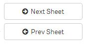

# Development work not finished, yet, stay tuned
# Sheet Navigation Extension for Qlik Sense
> 

---
## Table of Contents
<!-- toc -->

---

## Purpose and Description


## Screenshots

### Button styles

There are several predefined styles availabe from which you can choose:

> 

### Button icons
Every button can also be displayed with an icon:

> 

## Installation

## Configuration

### Layout

### Navigation Behavior

## Contributing


## Related projects


## Change Log
See CHANGELOG.yml

## License & Copyright

See LICENSE.md
