# sense-navigation
> Sheet Navigation + Actions visualization extension for Qlik Sense.

---

## Functionality
The Visualization Extension ***sense-navigation*** for Qlik Sense allows you to add a button to a Qlik Sense sheet to navigate in your app:

* Go to first sheet
* Go to next sheet
* Go to previous sheet
* Go to last sheet
* Go to a sheet
* Go to a sheet (defined by sheet Id)
* Go to a story
* Open a website / eMail
* Switch to the Edit mode

The button can be easily styled nicely by selecting some of the predefined designs ([Leonardo UI](https://qlik-oss.github.io/leonardo-ui/) or [Bootstrap](https://getbootstrap.com/)) or modified with your custom CSS.

Furthermore ***sense-navigation*** offers the option to define a **chain of 1-n actions** which will be executed **before** the navigation happens.  

For example:

* Apply a bookmark
* Clear selections
* Lock selections
* Unlock selections
* Select value(s) in a field
* Select alternatives
* Select possible values in a field
* Set a variable value

See [here](./docs/actions.md) for a complete list of all available **20 actions**.

_Note: The main difference between version 0.x and 1.x of sense-navigation is that with v1.x you can define a chain of unlimited actions instead of just two._

## Installation & Download
### Fresh Installation

0. ⚠️ **Do not download the entire Github repository, this will not work!**
1. Download the [latest version](https://github.com/stefanwalther/sense-navigation/raw/master/build/sense-navigation_latest.zip) version (or [any other version](https://github.com/stefanwalther/sense-navigation/tree/master/build) you want to install).
2. Then install on either *Qlik Sense Desktop* or *Qlik Sense Server*:

* Qlik Sense Desktop
	* To install, unzip all files and copy the content to the folder folder `"C:\Users\%USERNAME%\Documents\Qlik\Sense\Extensions\sense-navigation"`
* Qlik Sense Server
	* See instructions [how to import an extension on Qlik Sense Server](https://help.qlik.com/en-US/sense/September2018/Subsystems/ManagementConsole/Content/Sense_QMC/import-extensions.htm)

If you are running into any troubles, see [here for some FAQs](https://github.com/stefanwalther/sense-extension-install).

### You are already using an ***sense-navigation*** version < 1.x?

* I have unfortunately bad news: All versions < 1.x of ***sense-navigation*** are completely incompatible with version v1.x!
* If you upgrade to v1.x, you will have to
  * First uninstall the old ***sense-navigation*** extension (delete the folder in Qlik Sense Desktop or use QMC in Qlik Sense Server to remove the extension)
  * First install the new version of ***sense-navigation***.
  * Delete existing old instances of ***sense-navigation*** object in your apps.
  * Add it again to your sheets and apply the previous configurations.
  
### Should I upgrade?

See [here for more information](./docs/why-upgrade.md) what v1.x gives you and whether you should upgrade or not.

### Where do I find the 0.8x version of sense-navigation

Version v8.x of sense-navigation is available [here](https://github.com/stefanwalther/sense-navigation/tree/v0.8.x).

## Layout
***sense-navigation*** offers various options to define the layout of a button:

### Button Themes

There are several predefined styles available, you can choose from:

> 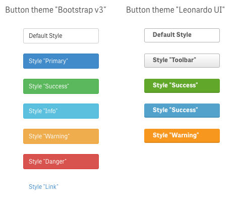

### Button icons

Every button can also include an icon. You can chose from a list of 851 available icons:
 
- Icon library [Fontawesome icons](http://fontawesome.io/): 675 icons
- Icon library [Leonardo UI icons](https://qlik-oss.github.io/leonardo-ui/icons.html): 176 icons

> 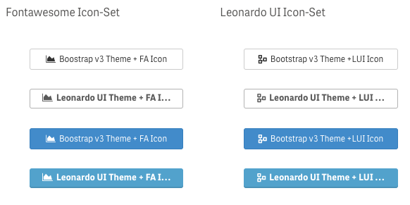

### Button Style by Qlik Expression

Buttons can also [chose a predefined style/theme based based on a custom expression](docs/config-layout.md#advanced-styling):

> 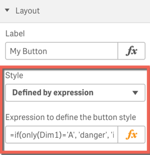

### Custom Styles (Custom CSS)

If you want to have full freedom over designing your button, just [use your custom CSS](docs/config-layout.md#custom-css):

> 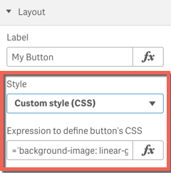

Result:

> 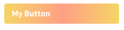

## Configuration
Drag & drop the object onto a sheet (as you would do it with any other native object or visualization extension).
Then define how the ***sense-navigation*** should behave:

- [Layout Options](./docs/config-layout.md)
- [Actions](./docs/config-actions.md)
- [Navigation Behavior](./docs/config-navigation-behavior.md)

## Examples
### Example Application

If you want to try the various options of this extension, download the [sample application](https://github.com/stefanwalther/sense-navigation/tree/master/example)

Some screenshots of the sample application

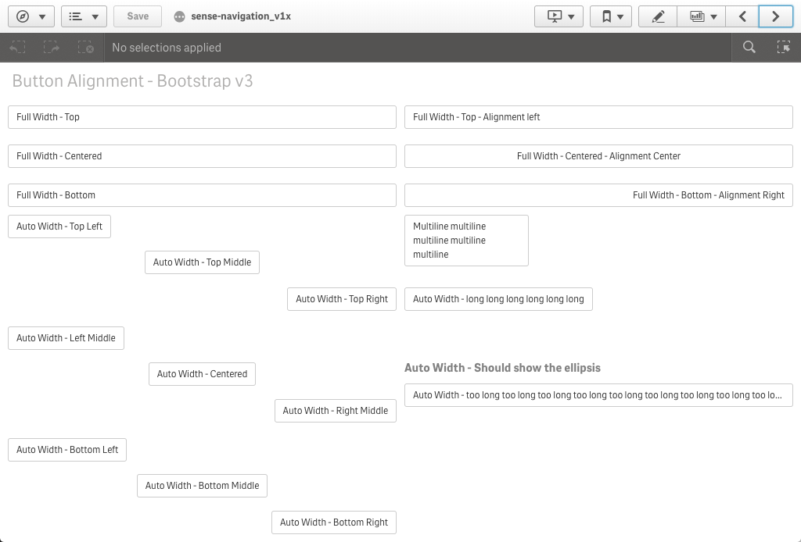
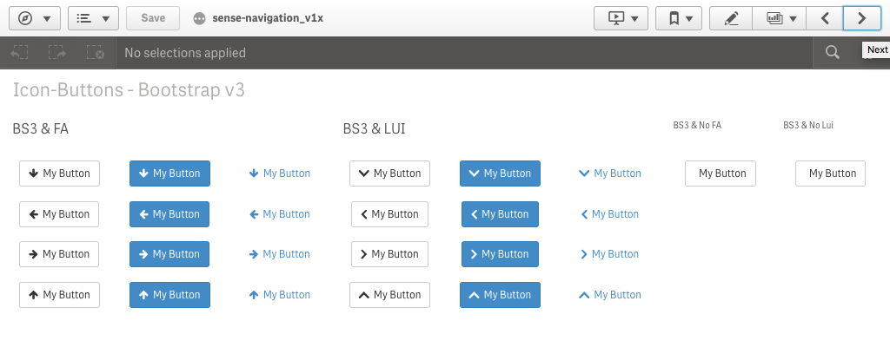
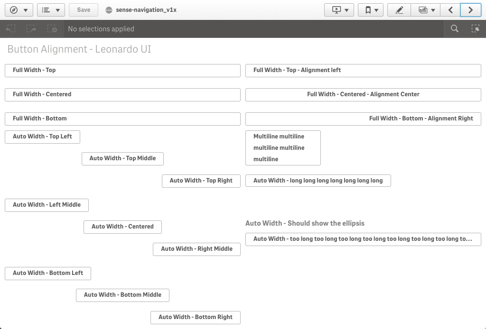
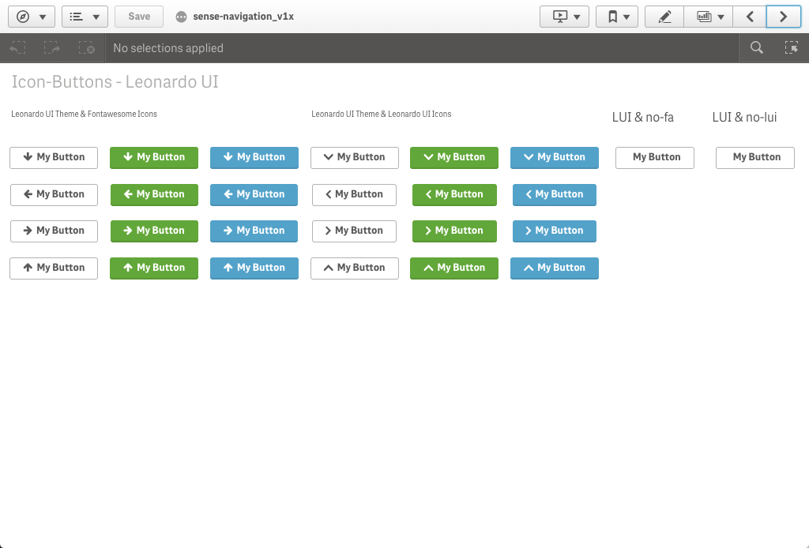
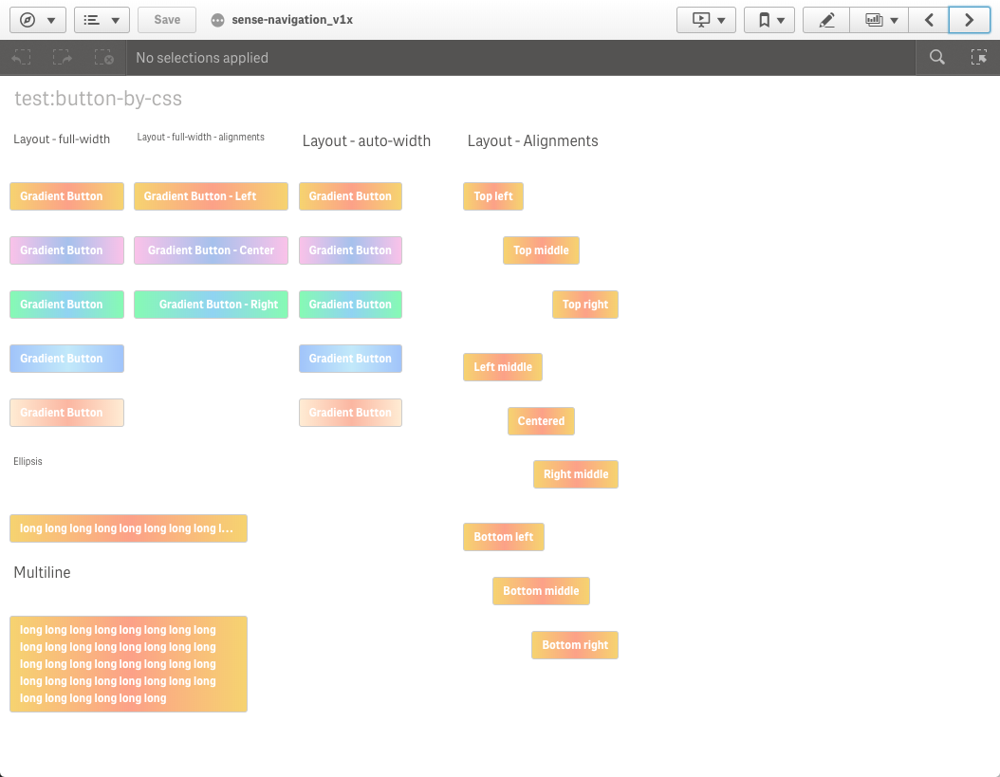
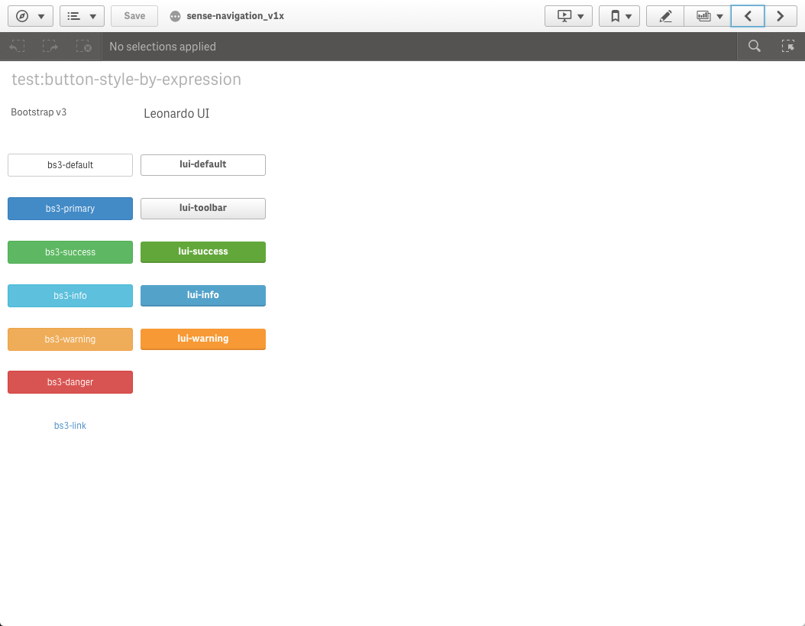

## Compatibility
**sense-navigation** is designed to work with Qlik Sense *September 2017* or higher.

This extension has been extensively tested with the following versions of Qlik Sense:

- Qlik Sense Desktop June 2018
- Qlik Sense Enterprise June 2018
- Qlik Sense Desktop September 2018
- Qlik Sense Enterprise September 2018

If you want to use _sense-navigation_ in older versions, install an older version than v1.0.

The following browsers have been tested:

- Internet Explorer 11
- Firefox
- Edge
- Chrome

### ***sense-navigation*** & Mashups

***sense-navigation*** it built to be used within the Qlik Sense Client.
Any usage in a mashup-based solution ***might work***, but there are many features in ***sense-navigation*** which can just never work in a mashup-based solution (e.g. "Go to next sheet", "Go to edit mode", etc.).
So use ***sense-navigation*** in a mashup-based solution only at your own risk!

### ***sense-navigation*** & DevHub

If you want use & modify the extension in DevHub, do the following:

- Use the file `./build/*_dev.zip`, this always represents the latest development build (so no minimized/uglified files, etc.)

## Related projects
Some related projects (Qlik Sense Visualization Extensions) I have recently created:

- [qliksense-extension-tutorial](https://www.npmjs.com/package/qliksense-extension-tutorial): Comprehensive tutorial to start developing Qlik Sense Extensions. | [homepage](https://github.com/stefanwalther/qliksense-extension-tutorial "Comprehensive tutorial to start developing Qlik Sense Extensions.")
- [sense-calendar-heatmap](https://www.npmjs.com/package/sense-calendar-heatmap): Qlik Sense Visualization Extension with a diverging color scale. The values are displayed as colored… [more](https://github.com/stefanwalther/qsCalendarHeatmap) | [homepage](https://github.com/stefanwalther/qsCalendarHeatmap "Qlik Sense Visualization Extension with a diverging color scale. The values are displayed as colored cells per day. Days are arranged into columns by week, then grouped by month and years.")
- [sense-extension-recipes](https://www.npmjs.com/package/sense-extension-recipes): Recipes on working with Qlik Sense Visualization Extensions. | [homepage](https://github.com/stefanwalther/sense-extension-recipes "Recipes on working with Qlik Sense Visualization Extensions.")
- [sense-funnel-chart](https://www.npmjs.com/package/sense-funnel-chart): Funnel Chart for Qlik Sense. | [homepage](https://github.com/stefanwalther/sense-funnel-chart "Funnel Chart for Qlik Sense.")
- [sense-media-box](https://www.npmjs.com/package/sense-media-box): Include web pages, videos, images and much more into your Qlik Sense app. | [homepage](https://github.com/stefanwalther/sense-media-box "Include web pages, videos, images and much more into your Qlik Sense app.")
- [sense-on-off-switch](https://www.npmjs.com/package/sense-on-off-switch): Set a variable in Qlik Sense to true/false using an on-off switch. | [homepage](https://github.com/stefanwalther/sense-on-off-switch "Set a variable in Qlik Sense to true/false using an on-off switch.")
- [sense-qr-code](https://www.npmjs.com/package/sense-qr-code): QR Code to be embedded into Qlik Sense. | [homepage](https://github.com/stefanwalther/qsQRCode "QR Code to be embedded into Qlik Sense.")
- [sense-range-slider](https://www.npmjs.com/package/sense-range-slider): Slider object for Qlik Sense to manipulate one or two variables. | [homepage](https://github.com/QlikDev/qsRangeSlider "Slider object for Qlik Sense to manipulate one or two variables.")
- [sense-themable-kpi-tile](https://www.npmjs.com/package/sense-themable-kpi-tile): KPI Tile for Qlik Sense with the ability to use themes or to customize background… [more](https://github.com/stefanwalther/sense-themable-kpi-tile) | [homepage](https://github.com/stefanwalther/sense-themable-kpi-tile "KPI Tile for Qlik Sense with the ability to use themes or to customize background color, comparison indicator, etc.")  

## About

### Room for improvements / contribution
Is there **anything else you'd like to see** in this visualization extension?

* Don't hesitate to add the feature and create a pull request!
* You don't have the time or skills to implement this specific feature? No problem, [drop a note here](https://github.com/stefanwalther/sense-navigation/issues).

### Authors & Contributors
**Stefan Walther**

* [qliksite.io](http://qliksite.io) - Qlik Sense / QAP related blog
* [qlikblog.at](http://qlikblog.at) - QlikView related blog
* [stefanwalther.io](http://stefanwalther.io) - Private blog
* [twitter/waltherstefan](http://twitter.com/waltherstefan)  
* [github.com/stefanwalther](http://github.com/stefanwalther)  

### Contributors
- [rvaheldendaten](https://github.com/rvaheldendaten)
- [rjriel](https://github.com/rjriel)

### Contributing
Pull requests and stars are always welcome. For bugs and feature requests, [please create an issue](https://github.com/stefanwalther/sense-navigation/issues).

I cannot guarantee that I will merge all PRs but I will evaluate them all.

#### Some Contribution Instructions

* [Get a list of all build actions](./docs/contrib-general.md)
* [Running/Validating the extension locally](./docs/contrib-run.md) (without having Qlik Sense Enterprise or Qlik Sense Desktop installed)
* [Building the project/extension](./docs/contrib-building.md)
* [Running tests](./docs/contrib-tests.md)
* [Updating/Building the documentation](./docs/contrib-docs.md)

### License
MIT

### Change log
See [CHANGELOG.yml](https://github.com/stefanwalther/sense-navigation/blob/master/CHANGELOG.yml)  

***

_This file was generated by [verb-generate-readme](https://github.com/verbose/verb-generate-readme), v0.8.0, on July 17, 2021._

