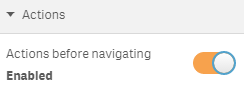

### Actions
You can furthermore define up to two action which will be executed before the navigation behavior will be performed.

First enable this option:

> 

Then select from the list of predefined actions:

> 

Depending on the selected action you'll see additional settings you can define, e.g. define the name of a variable and its value:

> 

As soon as you have defined the first action, you will also be able to define a second action.
