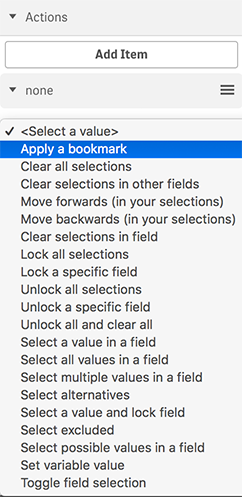
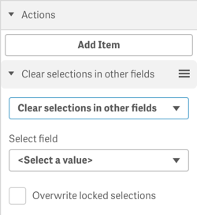
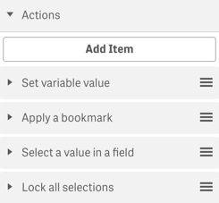

### Actions
You can furthermore define as many actions as you want, which will be executed in a chain before the [navigation behavior](config-navigation-behavior.md) will be performed.

Then select from the list of predefined actions:

> 

Depending on the selected action you'll see additional settings you can define, e.g. define the name of a variable and its value:

> 

You can add as many actions as you want:

> 

As soon as you have defined the first action, you will also be able to define another action.  
Either after the last action or in case no action has been defined, the [Navigation behavior](./config-navigation-behavior.md) will then apply.

## How does it work?

If you have defined multiple actions, the actions will be performed sequentially (in a chain).    
After the last action, the [navigation behavior](./config-navigation-behavior.md) runs as defined.