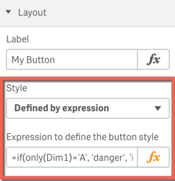
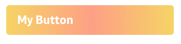

# Layout

> 

* **Label** - The buttons label.
* **Style** - Select one of the predefined styles or use 'Defined by expression'.
* **Button width** - Whether the button should spread of the entire grid column or just be as wide as necessary.
* **Button position** - Align the button within the given container.
* **Multiline label** - Whether the button can take one than more line.
* **Icon** - Choose one of the provided icons (based on [Font Awesome](https://fortawesome.github.io/Font-Awesome/))

## Advanced Styling

### Predefined styles by expression

If you have selected "Defined by expression" you can select one of the predefined styles by expression.

The expression must result to one of the following values, which represent the available styles:

Bootstrap v3 styles:

  - `bs3-default`
  - `bs3-primary`
  - `bs3-success`
  - `bs3-info`
  - `bs3-warning`
  - `bs3-danger`
  - `bs3-link`
    
Leonardo UI styles:

  - `lui-default`
  - `lui-toolbar`
  - `lui-success`
  - `lui-info`
  - `lui-warning`
    
> 

### Custom CSS

Alternatively you can select "Custom style (CSS)" to provide your custom style definition for the button:

> 

**Example:**

```
='background-image: 
    linear-gradient(to right, 
        #f6d365 0%, 
        #fda085 51%, 
        #f6d365 100%); 
  color: white; font-weight:bold'
```

results into:



---

Back to the main [documentation](./../README.md)
