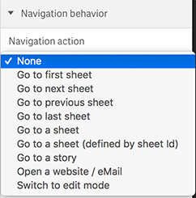

### Navigation Behavior
Define the behavior of the button. The following options are available:

> 

* Go to first sheet
* Go to next sheet
* Go to previous sheet
* Go to last sheet
* Go to a sheet _(if selected you'll see a list of sheets you can select from)_
* Go to a sheet (defined by sheet Id)
* Go to a story _(if selected you'll see a list of stories you can select from)_
* Open website / eMail _(if selected, you'll have to enter the URL in the appearing text box)_
* Switch to edit mode
